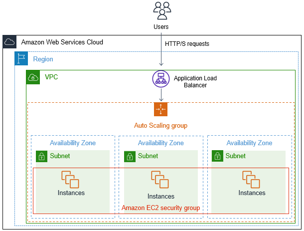

# terraform-autoscaling
Autoscaling Groups and Elastic Load Balancing (ASG and ELB)

# Auto Scaling Group

1. Auto scaling ensure that EC2 instances are sufficient to run your application.
2. When the number of requests increases the load on the VM instance increase AWS will identify and auto scale the resources as per the defined configuration

## Auto scaling group

> An Auto Scaling group contains a collection of EC2 instances that are treated as a logical grouping for the purposes of automatic scaling and management. 

> An Auto Scaling group also enables you to use Amazon EC2 Auto Scaling features such as health check replacements and scaling policies

